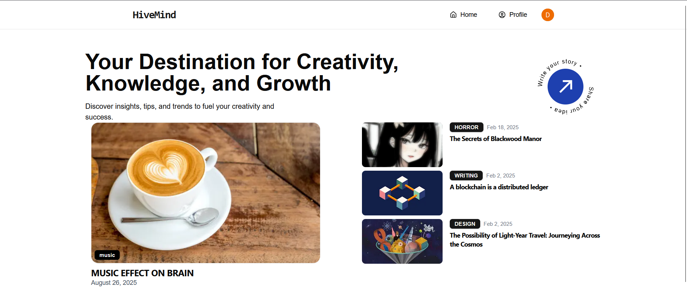

# HiveMind



HiveMind is a modern, full-stack blogging platform built with Next.js, Clerk authentication, Prisma ORM, and Cloudinary for media uploads. Users can create, edit, and share stories with rich media content, including images and videos. The platform supports tagging, comments, and likes, providing a social and interactive blogging experience.

---

## Features

- **User Authentication:** Secure sign-up and login using Clerk.
- **Rich Story Editor:** Write stories with formatting (bold, italic, underline), image and video uploads.
- **Media Uploads:** Images and videos are uploaded and served via Cloudinary.
- **Tagging System:** Add and manage tags for better content discovery.
- **Comments & Likes:** Engage with stories through comments and likes.
- **Personalized Dashboard:** View and manage your own blogs.
- **Responsive UI:** Clean, modern design with Tailwind CSS.

---

## Tech Stack

- **Frontend:** React, Next.js, Tailwind CSS
- **Backend:** Next.js API routes, Prisma ORM
- **Authentication:** Clerk
- **Database:** PostgreSQL (via Prisma)
- **Media Storage:** Cloudinary

---

## Getting Started

### 1. Clone the repository

```bash
git clone https://github.com/yourusername/hivemind.git
cd hivemind
```

### 2. Install dependencies

```bash
npm install
```

### 3. Set up environment variables

Create a `.env.local` file in the root directory and add the following:

```env
NEXT_PUBLIC_CLERK_PUBLISHABLE_KEY=your_clerk_publishable_key
CLERK_SECRET_KEY=your_clerk_secret_key

NEXT_PUBLIC_CLOUDINARY_CLOUD_NAME=your_cloudinary_cloud_name
NEXT_PUBLIC_CLOUDINARY_API_KEY=your_cloudinary_api_key
CLOUDINARY_API_SECRET=your_cloudinary_api_secret

DATABASE_URL=your_postgres_database_url
```

### 4. Set up the database

```bash
npx prisma migrate dev --name init
```

### 5. Run the development server

```bash
npm run dev
```

Visit [http://localhost:3000](http://localhost:3000) to view the app.

---

## Project Structure

```
actions/           # Server actions (blog, comments, likes, etc.)
components/        # React components (editor, blog display, etc.)
lib/               # Utility libraries (prisma, cloudinary, etc.)
public/readme/     # Static assets for README
pages/             # Next.js pages and API routes
prisma/            # Prisma schema and migrations
```

---

## Key Files

- `actions/blogAction.js` – Handles blog creation, media upload, comments, and likes.
- `components/WriteStory.jsx` – Rich text editor for creating stories with media.
- `components/ImageAndBlog.jsx` – Displays blog content with image/video.
- `lib/cloudinary.js` – Cloudinary configuration.
- `lib/prisma.js` – Prisma client setup.

---

## Authentication & Authorization

- Uses Clerk for user authentication.
- Protected routes/components check login status using Clerk’s `useUser` hook or `<SignedIn>`/`<SignedOut>` components.
- Unauthenticated users are redirected to the sign-in page.

---

## Media Upload

- Images and videos are uploaded to Cloudinary via server actions.
- Only logged-in users can upload media and create blogs.

---

## License

MIT

---

## Acknowledgements

- [Clerk](https://clerk.dev/)
- [Cloudinary](https://cloudinary.com/)
- [Prisma](https://prisma.io/)